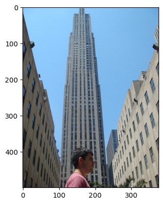

# Caption Generator from Images  

This project implements an image captioning model that generates descriptive captions for images using deep learning techniques. The model is built using Python and leverages popular libraries such as TensorFlow and Keras.  

## Table of Contents  

- [Introduction](#introduction)  
- [Model Architecture](#model-architecture)  
- [Hyperparameters](#hyperparameters)  
- [Installation](#installation)  
- [Results](#results)  
- [License](#license)  

## Introduction  

The goal of this project is to create a model that can automatically generate captions for images. This is achieved by combining Convolutional Neural Networks (CNNs) for image feature extraction with Recurrent Neural Networks (RNNs) for sequence generation.  

## Model Architecture  

The model consists of two main components:  

1. **Image Feature Extractor**: A pre-trained CNN (e.g., VGG16, InceptionV3) is used to extract features from the input images.  
2. **Caption Generator**: An RNN (typically LSTM or GRU) processes the extracted features and generates captions word by word.  

### Model Flow  

1. **Input Image**: An image is passed through the CNN to obtain a feature vector.  
2. **Sequence Generation**: The feature vector is fed into the RNN, which generates a sequence of words (caption) based on the learned patterns from the training data.  

## Hyperparameters  

The following hyperparameters were used in the model training:  

- **Learning Rate**: 0.001  
- **Batch Size**: 32  
- **Epochs**: 50  
- **Embedding Dimension**: 256  
- **LSTM Units**: 512  
- **Dropout Rate**: 0.5  

These hyperparameters can be adjusted based on the dataset and desired performance.  

## Installation  

To set up the project, clone the repository and install the required packages:  

```bash  
git clone https://github.com/ankitrajsh/Caption-Generator-from-images.git  
cd Caption-Generator-from-images  
pip install -r requirements.txt
```
## Results  

The model was evaluated on a test dataset, and the generated captions were compared to the ground truth captions. The performance metrics include BLEU scores and human evaluation.  

### Example Output  
**Input Image**: 

**Actual Descriptions**:
- *startseq: man is standing in front of skyscraper endseq.*
- *startseq: man stands in front of skyscraper endseq.*
- *startseq: man stands in front of very tall building endseq.*
- *startseq: behind the man in red shirt stands large skyscraper endseq.*
- *startseq: there is a skyscraper in the distance with man walking in front of the camera endseq.*

**Predicted Description**:
- *startseq: man stands in front of very tall building endseq.*


## License  

This project is licensed under the MIT License. See the [LICENSE](LICENSE) file for details.  

## Acknowledgments  

- [TensorFlow](https://www.tensorflow.org/)  
- [Keras](https://keras.io/)  
- [VGG16](https://arxiv.org/abs/1409.1556)
